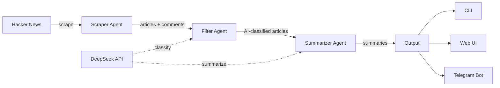
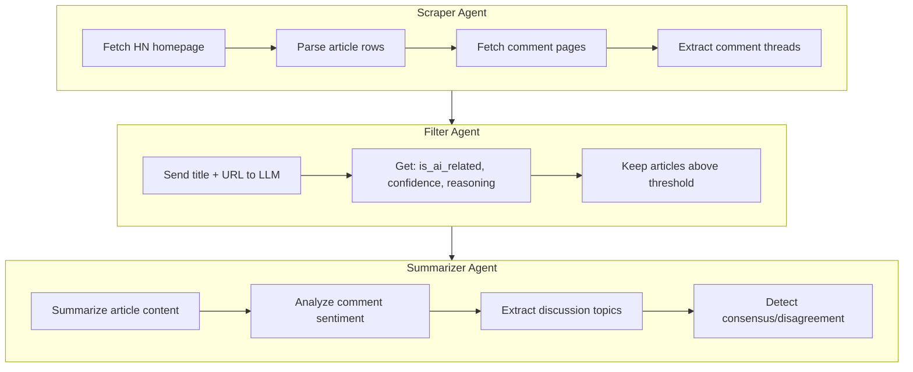
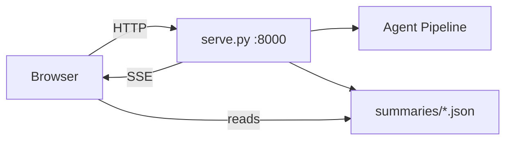
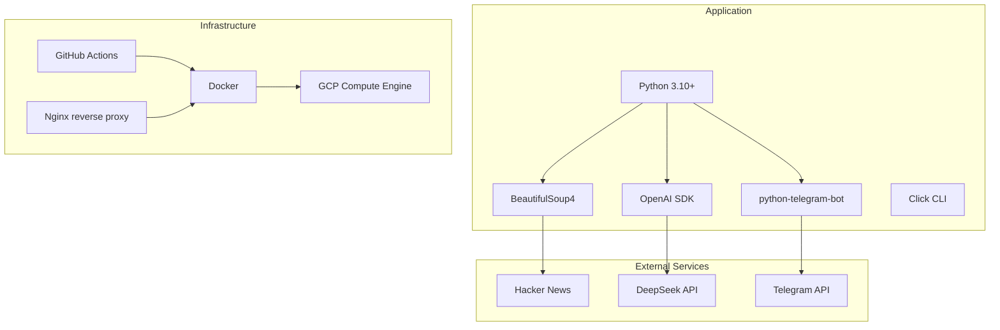
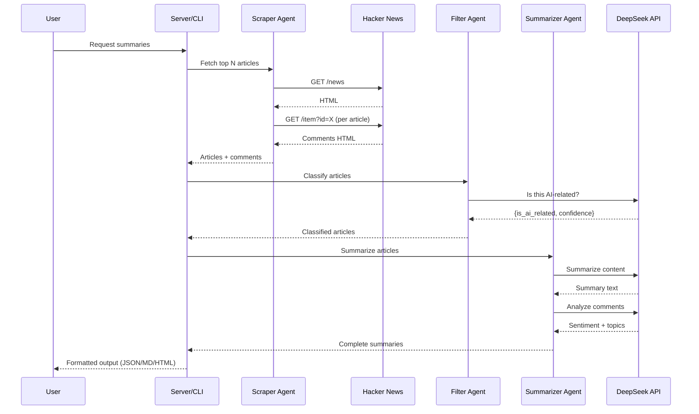
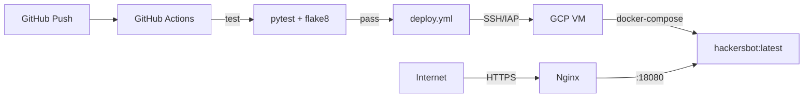

# HackerNews AI Summarizer

A multi-agent Python app that scrapes Hacker News, filters AI-related topics, and generates intelligent summaries using DeepSeek's LLM API. Available as a CLI tool, Telegram bot, and web UI.

**Live:** [hackernews.photogroup.network](https://hackernews.photogroup.network)

---

## How It Works



### Agent Pipeline

Each request flows through three specialized agents:

| Agent | Role | What it does |
|-------|------|-------------|
| **Scraper** | Data collection | Fetches top N articles from HN, parses titles, points, authors, and comment threads |
| **Filter** | Classification | Uses DeepSeek to classify each article as AI-related or not (with confidence score) |
| **Summarizer** | Analysis | Generates article summaries, comment sentiment analysis, topic extraction, and consensus detection |



---

## Quick Start

### 1. Clone & setup

```bash
git clone https://github.com/acuhlmann/hackersbot.git
cd hackersbot
python -m venv venv
source venv/bin/activate      # Linux/Mac
# venv\Scripts\activate.bat   # Windows
pip install -r requirements.txt
```

### 2. Configure

```bash
cp .env.example .env
# Edit .env and add your DeepSeek API key
```

Get a key from [platform.deepseek.com](https://platform.deepseek.com).

### 3. Run

```bash
# CLI - summarize top 3 articles
python -m src.main --top-n 3

# Web UI
python serve.py

# Telegram bot
python -m src.telegram_bot
```

---

## Interfaces

### CLI

```bash
python -m src.main [OPTIONS]
```

| Option | Default | Description |
|--------|---------|-------------|
| `--top-n N` | 3 | Number of articles to fetch |
| `--filter-ai` | off | Only keep AI-related articles |
| `--min-confidence F` | 0.5 | Confidence threshold for AI filter |
| `--no-comments` | off | Skip comment summarization |
| `--output-format` | both | `console`, `file`, or `both` |

Output saved to `outputs/YYYY-MM-DD_summary.json` and `.md`.

### Web UI



Features:
- Browse historical daily summaries in sidebar
- Manual refresh with real-time SSE progress streaming
- On-demand single-article summaries (paste HN item ID)
- Sentiment visualization and topic extraction
- Auto-refresh daily at 6:00 AM (GMT+8)
- Rate limited: 1 full refresh/hour, 10 ad-hoc summaries/day per article

**API endpoints:**

| Endpoint | Method | Purpose |
|----------|--------|---------|
| `/` | GET | Serve the SPA |
| `/api/status` | GET | Refresh status and last refresh time |
| `/api/refresh` | POST | Trigger top-5 summary refresh |
| `/api/adhoc-summaries` | GET | List single-article summaries |
| `/api/adhoc-summaries` | POST | Create single-article summary `{"item_id": "12345"}` |
| `/api/adhoc-status/{id}` | GET | Check ad-hoc summary status |
| `/refresh-stream` | GET | SSE stream for refresh progress |
| `/summaries/*` | GET | Static summary JSON files |

### Telegram Bot

Create a bot via [@BotFather](https://t.me/BotFather), set `TELEGRAM_BOT_TOKEN` in `.env`, then run `python -m src.telegram_bot`.

| Command | Description |
|---------|-------------|
| `/start` | Welcome message |
| `/summary [N]` | Summarize top N articles (default: 3) |
| `/ai [N]` | AI-related articles only (scans top N, default: 10) |
| `/help` | Show help |

---

## Architecture

### Project Structure

```
hackersbot/
├── src/
│   ├── main.py                  # CLI entry point
│   ├── telegram_bot.py          # Telegram bot
│   ├── agents/
│   │   ├── scraper_agent.py     # HN web scraper
│   │   ├── filter_agent.py      # AI topic classifier
│   │   └── summarizer_agent.py  # LLM summarizer
│   ├── models/
│   │   ├── llm_client.py        # Unified LLM interface
│   │   └── deepseek_client.py   # DeepSeek API wrapper
│   └── utils/
│       ├── storage.py           # File I/O
│       └── formatters.py        # Output formatting
├── web/
│   ├── index.html               # SPA (vanilla JS)
│   └── generate_index.py        # Summary index generator
├── serve.py                     # Web server + API + SSE
├── summaries/                   # Generated daily summaries
│   └── adhoc/                   # Single-article summaries
├── outputs/                     # CLI output directory
├── tests/                       # pytest test suite
├── scripts/
│   ├── vm-startup.sh            # GCP VM boot script
│   └── vm-disk-cleanup.sh       # Disk space management
├── .github/workflows/
│   ├── deploy.yml               # GCP deployment
│   └── python-app.yml           # CI tests
├── Dockerfile                   # Multi-stage production build
├── docker-compose.yml           # Local dev container
└── deploy-docker.sh             # GCP deploy script
```

### Tech Stack



### Data Flow



---

## Deployment

### Docker (local)

```bash
docker-compose up
# Runs at http://localhost:18080
```

### Docker (production)



The `deploy.yml` workflow:
1. Runs tests on push to `main`
2. On success, SSHs into GCP VM (direct or IAP tunnel)
3. Builds Docker image on the VM
4. Runs via `docker-compose`

**Required GitHub secrets:**
- `GCP_SA_KEY` - GCP service account JSON key
- `DEEPSEEK_API_KEY` - DeepSeek API key

**GCP service account permissions:**
- **Direct SSH:** `roles/compute.osLogin` or `roles/compute.instanceAdmin.v1`
- **IAP tunnel:** additionally `roles/iap.tunnelResourceAccessor` (set `USE_IAP_TUNNEL=1`)

**Defaults:** Project `photogroup-215600`, zone `us-central1-a`, instance `hn-vm` (Always Free e2-micro). Override with `PROJECT`, `ZONE`, `INSTANCE` env vars.

**HTTPS:** Nginx on the VM terminates TLS for `hackernews.photogroup.network` (Let's Encrypt via certbot). Keep the Cloudflare DNS record for `hackernews` **DNS only** (grey cloud) so HTTP-01 renewals can reach the VM. Re-issue or renew with:

```bash
./setup-ssl.sh
# or:
gcloud compute ssh hn-vm --project=photogroup-215600 --zone=us-central1-a \
  --command "sudo certbot --nginx -d hackernews.photogroup.network --non-interactive --agree-tos --redirect"
```

### VM Startup Script

`scripts/vm-startup.sh` runs on every VM boot to:
- Expand filesystem to use all available disk
- Prune Docker resources (containers, images, volumes)
- Clean system caches
- Ensure the hackersbot container is running
- Restart nginx if installed

---

## Configuration

| Variable | Default | Required | Description |
|----------|---------|----------|-------------|
| `DEEPSEEK_API_KEY` | - | Yes | DeepSeek API key |
| `DEEPSEEK_MODEL` | `deepseek-chat` | No | Model name |
| `TELEGRAM_BOT_TOKEN` | - | For bot | Telegram bot token |
| `PORT` | `8000` | No | Web server port |
| `BIND_ADDRESS` | `0.0.0.0` | No | Server bind address |

---

## Testing

```bash
pip install -r requirements.txt
pytest -v
```

Tests cover all agents, the web server, formatters, storage, and index generation. CI runs on every push via GitHub Actions (`python-app.yml`).

---

## License

MIT
